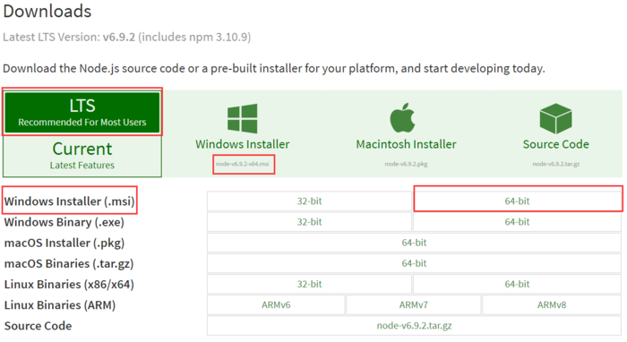
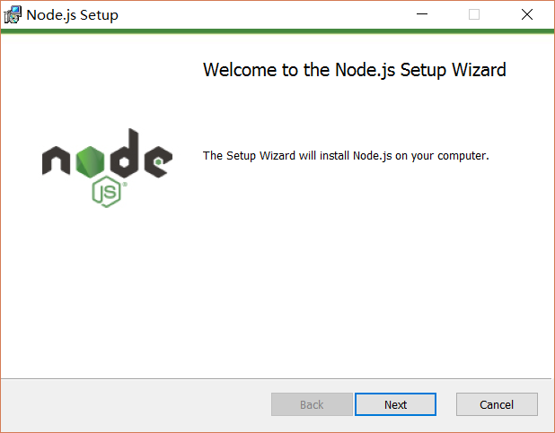
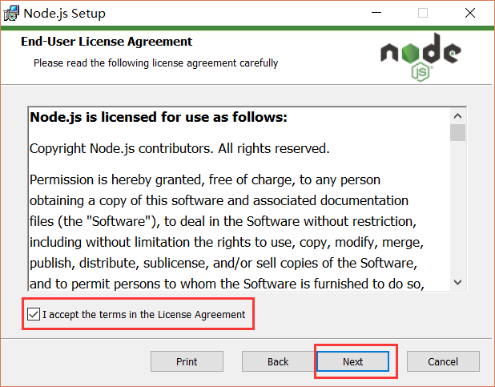
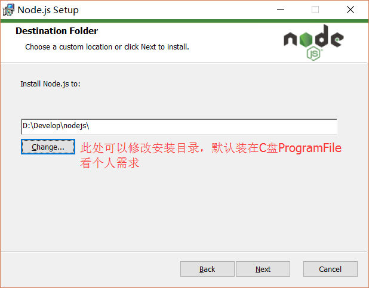
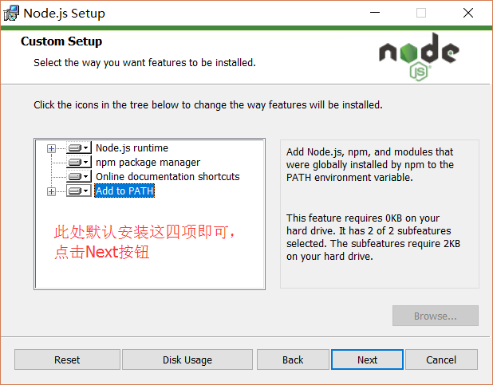
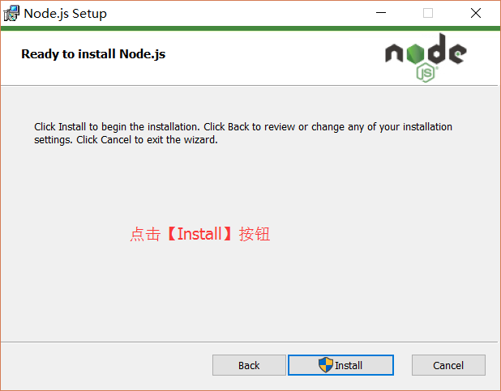
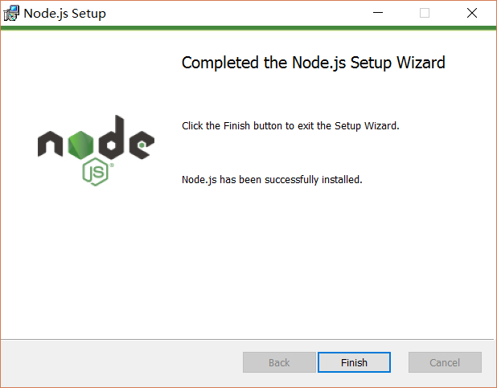

## Node & Npm

### Node简介

[Node.js](http://nodejs.cn/) 是运行在服务端的javascript。Node.js是基于Chrome V8引擎的javascript运行环境。Node.js使用了一个事件驱动、非阻塞式I/O模型，使其清亮又高效。Node.js的包管理工具[npm](https://www.npmjs.com.cn/),是全球最大的开源库

### 安装Node & Npm
目前node安装包中自带npm, 一般来说，安装好node, npm也会一起安装

#### _Window_ 上安装

1 下载对应系统的Node 

  

2 开始安装 

  

3 点击【_Next_】按钮 

  

4 勾选复选框，点击【_Next_】按钮 

  

5 修改好安装目录，点击【_Next_】按钮 

  
  

6 安装完成后, 点击【_Finish_】按钮完成安装 

  

#### _Mac_ 上安装
* 参考Window 从Node官网下载对应版本安装包，安装步骤与Window类似, 步骤略表

* 通过homebrew安装

1 安装homebrew, 如已安装请忽略，可通过 brew -v判断是否安装homebrew

     /usr/bin/ruby -e "$(curl -fsSL https://raw.githubusercontent.com/Homebrew/install/master/install)"

2 然后运行

    brew update

3 添加<code>homebrew</code>安装路径到<code>.bash_profile</code>文件中

    export PATH="/usr/local/bin:$PATH"

4 安装Node
  
    brew install node

### 测试Node和Npm是否安装成功

1 打开命令行

2 输入

    node -v

    npm -v

  如果显示出版本号，则表示已安装完毕，版本号如果与上图显示不一致不用在意，可能是安装的版本不同所致

### Node和Npm升级

